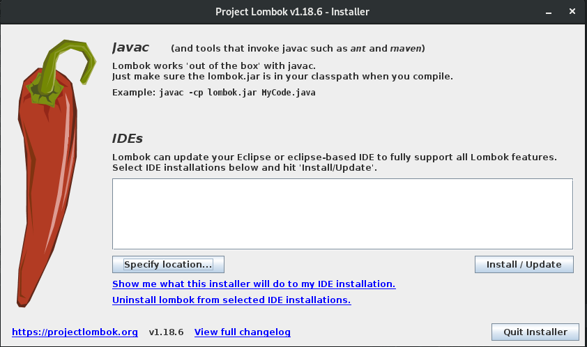
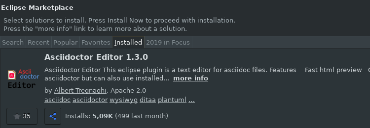
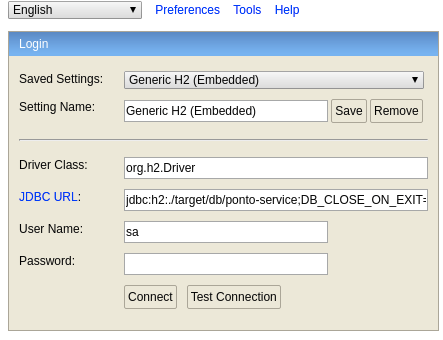

= Controle, Organização e Velocidade
:toc:
:toc-title: Índice
:sectnums:
:experimental:

== Configuração do Ambiente de Desenvolvimento 

=== Instalção do Lombok

**Introdução ao Lombok**

O Projeto Lombok é uma biblioteca java que retira a verbosidade do código, sem a necessidade de criar método getter ou equals novamente, com uma anotação sua classe tem um construtor com todos os recursos.

**1.** Para Instalar o Lombok baixe a versão do lombok1.18.6.jar, que está no link http://repo.tre-pa.jus.br/downloads/

**2.** Após ter baixado o jar do lombok é necessário executá-lo com o seguinte comando no terminal java -jar lombok.jar, em seguida irá aparecer um modal que pedirá para você selecionar o local de onde está instalada sua IDE Sts/Eclipse.

 

=== Instalação de Plugins

**1.** Instalação do Plugin Editor Asciidoc no STS/Eclipse.

No STS/Eclipse entre na marketplace da IDE e pesquise pelo nome Asccidoctor Editor e siga o processo de instalação.

 

Caso queira saber mais sobre a biblioteca acesse o site oficial: http://plantuml.com/ 

 
== Instalação do Keycloak

**1.** Baixa o http://repo.tre-pa.jus.br/downloads/keycloak-4.8.3.Final.zip[keycloak]

**2.** Descompactar

Diretório de Instalação: $HOME/opt/

sudo tar xvfz ~/Downloads/keycloak-4.8.3.Final.tar.gz

**3.** Alterar a porta do Keycloak editando o arquivo standalone.xml

[source, sh]
----
sudo gedit /opt/keycloak-4.8.3.Final/standalone/configuration/standalone.xml
----

Alterar a linha de definição do offset de 

[source, sh]
----
<socket-binding-group name="standard-sockets" default-interface="public" port-offset="{$}{jboss.socket.binding.port-offset:0}">
----

Para:

[source, sh]
----
<socket-binding-group name="standard-sockets" default-interface="public" port-offset="{$}{jboss.socket.binding.port-offset:5}">
----

**4.** Iniciar o keycloak 

[source, sh]
----
/opt/keycloak-4.8.3.Final/bin/standalone.sh &
---- 

**5.** Acessar no navegador localhost:8085/auth

[source, sh]
----
usuario:admin
senha:admin
----

=== Registrando a aplicação no keycloak em ambiente local

Para registrar a aplicação como __client__ no keycloak juntamente com as opções de autorização siga com os procedimentos abaixo: 

IMPORTANT: Para a correta execução do script é necessário que a instalação do *keycloak-4.8.3.Final* esteja localizada em `$HOME/opt/` e o serviço do keycloak na porta `8085`.

. Abrir o terminal do linux. 

. Entrar na raiz do projeto *${projectName}-service* e executar o script: ` ./scripts/keycloak/register-client.sh`

. No navegador web, logar na interface de administração do keycloak (http://localhost:8085/auth).

. Ir em menu:Clients[${projectName}-service > Authorization > Settings > Import > Select file]

. Selecionar o arquivo localizado em: `${projectName}-service/src/main/resources/client-authz-config.json`

. Clicar em *Import*.

Após os procedimentos acima a aplicação ${projectName}-service estará com seu registro de segurança no keycloak efetivado.

Obs.: Se existir o front-end (Angular), deve-se então proceder com o restante da configuração do keycloak conforme o arquivo *README.adoc* localizado na pasta raiz do front-end.

== Acesso no H2

**Introdução**

Após ter criado a sua aplicação você precisará de um banco de dados para realizar teste, o banco utilizado por default pelo stool é o H2, como pode swr observado 
no arquivo *src/main/resources/application.properties*, no item *spring.datasource.url*

**1.** Para acessar o banco h2 é necessário que aplicação esteja rodando. Para acessar a url do banco siga o padrão abaixo:

[source,sh]
-----

localhost:8080/${projectName}-service/h2/

----- 
 
**2.** Após a instalação você verá a tela de credenciais, nessa parte você deve substituir as configurações descrita abaixo pelas que estão no arquivo `${projectName}-service/src/main/resources/application.properties`

[source,sh]
----
JDBC URL:
User Name:
Password: 
----

IMPORTANT: Caso não venha uma senha definida no projeto você pode criar uma como padrão, alterando as linhas abaixo no *src/main/resources/application.properties*:

[source,sh]
-----
	spring.datasource.username
	spring.datasource.password
----- 

